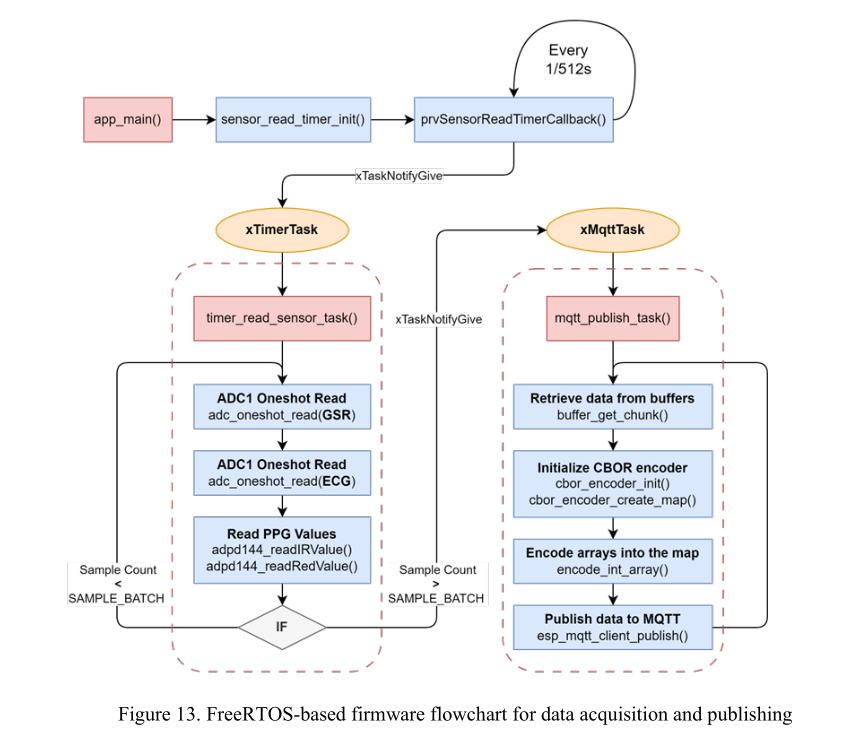
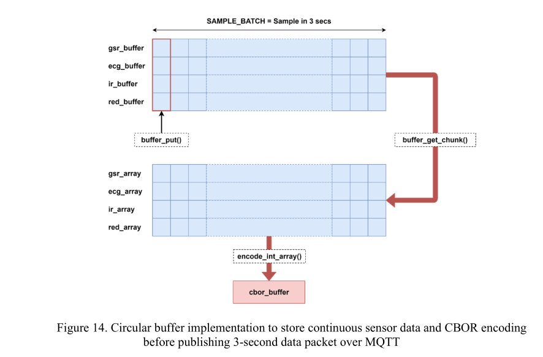
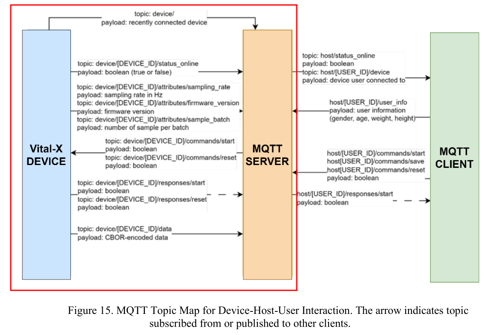

# VitalX Firmware

## What was implemented

This repository contains the ESP32 firmware for the Vital-X pain detection device. The implementation focuses on reading physiological signals from hardware, batching them in memory, packaging them efficiently, and sending them to a remote broker for analysis and visualization.

### 1. Sensor acquisition

The firmware reads two categories of signals:

- GSR and ECG through the ESP32 ADC inputs
- IR and red PPG values through the ADPD144 sensor

The key development concept here is sensor acquisition with calibrated ADC reads and a timer-driven sample loop. The code uses:

- ADC calibration for reliable analog-to-digital conversion
- oneshot ADC configuration for low-overhead sampling
- FreeRTOS timers to trigger sensor reads at a fixed rate

This is the part that turns raw hardware signals into usable digital samples.

Current runtime configuration:

- Sampling rate: 512 Hz
- Batch size: 512 samples
- Payload encoding: CBOR



### 2. Real-time buffering

The firmware uses circular buffers to handle continuous sampling without blocking or dropping data. Each signal stream has its own buffer:

- GSR buffer
- ECG buffer
- IR buffer
- Red buffer

This is a practical embedded-systems pattern: the sensor task writes samples continuously, and the publish task reads out a full batch later. The important idea is that data is decoupled from transmission, so you can avoid sending small fragmented packets every few milliseconds.

The implementation keeps a fixed batch size and periodically extracts a chunk from each buffer before encoding and publishing.



### 3. MQTT communication

The device communicates with a secure MQTT broker using the ESP-IDF MQTT client. The implementation is built around asynchronous event handling, which means the firmware reacts to connection events, subscriptions, received commands, and errors without blocking the main data path.

The firmware publishes:

- device online status
- firmware version
- sampling metadata
- RSSI information
- CBOR-encoded sensor batches

It also subscribes to command topics to support remote control:

- start data publishing
- stop data publishing
- restart/reset the device

The topic design is intentionally device-scoped, so each ESP32 instance keeps its own data stream and command channels.



### 4. Wi-Fi provisioning and connectivity

The device includes Wi-Fi provisioning support using the ESP-IDF provisioning framework. This is useful because the firmware can be configured at runtime instead of hardcoding credentials into firmware.

The implementation includes:

- SoftAP or BLE provisioning flow
- QR-provisioning support
- NVS-backed credential storage
- reconnect logic after connection loss
- reset/reprovisioning support

The important design idea here is that the device can be deployed in the field and configured by a user or service without reflashing the firmware.

### 5. Time synchronization

The firmware synchronizes the local clock using SNTP before producing timestamped sensor packets. This matters because the sensor data is grouped into batches and then published to MQTT. Without a valid time source, the downstream analytics side has no reliable chronology for the readings.

### 6. Device health and operational status

The firmware also includes a few reliability features common in embedded systems:

- LED status indication for connection state
- last-will MQTT messages for offline detection
- restart after repeated disconnects
- optional heap monitoring for debugging memory issues

These features are not the core signal-processing logic, but they are important for making the device stable in the field.

## Firmware structure

```text
firmware/
└── esp32-VitalX/
    ├── CMakeLists.txt
    ├── sdkconfig
    ├── components/
    │   └── adpd144/
    ├── main/
    │   ├── app_main.c
    │   ├── app_main.h
    │   ├── app_adc.c
    │   ├── app_mqtt.c
    │   ├── app_time.c
    │   ├── circular_buffer.c
    │   ├── wifi_prov.c
    │   ├── Kconfig.projbuild
    │   └── idf_component.yml
    └── managed_components/
```

Key firmware files:

- app_main.c: main application loop, sensor batching, MQTT control, task scheduling
- app_adc.c: ADC calibration and reading logic
- app_mqtt.c: MQTT client configuration and event handling
- app_time.c: SNTP and timestamp handling
- wifi_prov.c: Wi-Fi provisioning and connection flow
- circular_buffer.c: ring-buffer implementation for the sensor streams
- Kconfig.projbuild: custom project configuration for MQTT and Wi-Fi settings

## Build notes

This project uses the ESP-IDF framework and is configured as an ESP32 firmware target.

Typical workflow:

```bash
cd firmware/esp32-VitalX
idf.py set-target esp32
idf.py build
idf.py flash monitor
```

The project includes a custom firmware version definition in the CMake configuration and config entries for the MQTT broker URL, credentials, and Wi-Fi provisioning configuration.

## Learning references

- ESP-IDF: https://docs.espressif.com/projects/esp-idf/en/latest/esp32/index.html
- FreeRTOS: https://www.freertos.org/
- CBOR Encoding: https://github.com/intel/tinycbor
- MQTT over TLS with HiveMQ: https://www.hivemq.com/blog/mqtt-essentials-part-1-introducing-mqtt/

---

This README summarizes the implementation that was completed in the current firmware codebase.
